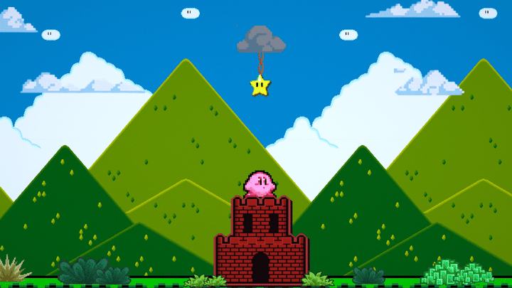
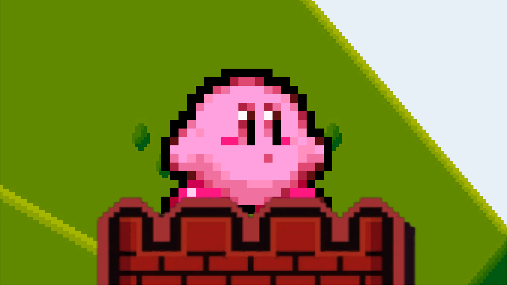
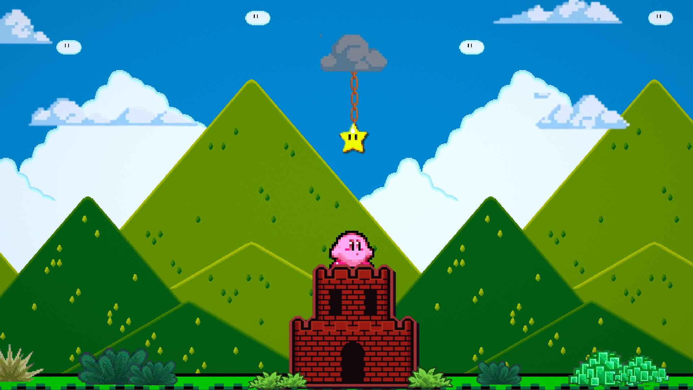
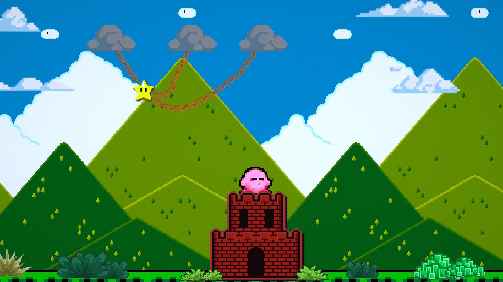
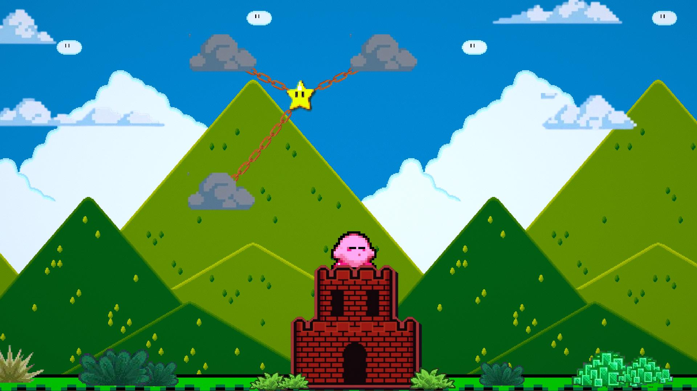
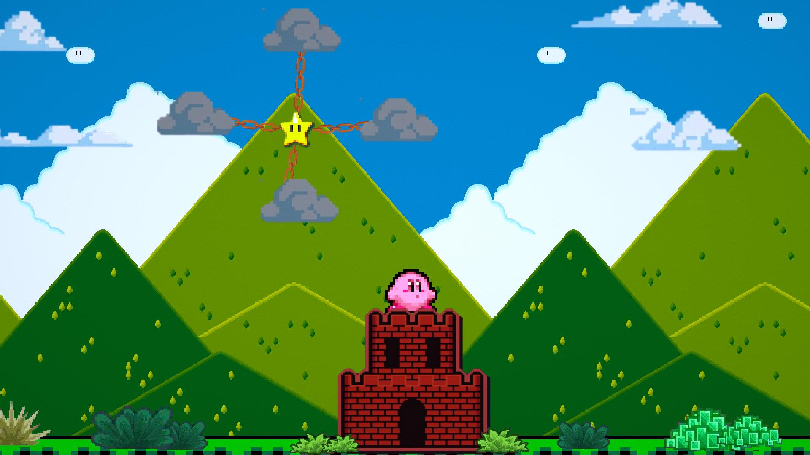

# Hungry Kirby

**Hungry Kirby** is a physics-based puzzle game built in **Unity 2D**.

## Gameplay

The goal is simple: Feed Kirby the Star!
Solve environmental puzzles to guide the candy-like Star into Kirby's waiting mouth.

## Interaction

- **Kirby**:
  - Waiting for food? He gets doubtful.
  - Click him 3 times? He acts cute ("Pookie").
  - Click him too much (6+ times)? He gets **Angry**!
- **Star**:
  - The objective object. Navigate it through obstacles to reach Kirby.
  - Once caught, Kirby eats it, and the level progresses.

## Features

- **Interactive Character**: Kirby reacts to player input and idle time.
- **Physics Puzzles**: (Inferred) Use ropes/lines (based on file list `LineManager.cs`) to manipulate the Star's path.
- **Level Progression**: Automatically loads the next level upon success.

## Tech Stack

- **Engine**: Unity 2D
- **Language**: C#

## Project Structure

- `Assets/Scripts/KirbyBehaviour.cs`: Controls Kirby's states (Idle, Eating, Angry) and collision logic.
- `Assets/Scripts/LineManager.cs`: Handles the drawing/cutting of ropes (Core mechanic).
- `Assets/Scripts/LevelManager.cs`: Manages scene transitions.

## Script Reference

### Gameplay
- **`KirbyBehaviour.cs`**: The main character controller. Tracks mouse clicks to determine Kirby's mood (Cute vs. Angry) and handles the "Eat" sequence when the Star arrives.
- **`LineManager.cs`**: Input handler for the "Cutting" mechanic. Detects mouse swipes and spawns visual trail effects.
- **`LevelManager.cs`**: Singleton for scene management and level progression.

### Environment & Physics
- **`CloudMovement.cs`**: Adds life to the background by moving cloud layers.
- **`SafetyNetBehaviour.cs`**: A trigger zone at the bottom of the level to catch falling Stars or restart the level on failure.
- **`StarAnimation.cs`**: Visual effects for the objective object (The Star).
- **`LinkGenerator.cs`**: (Inferred) Procedurally generates the chain links/rope segments for the physics puzzles.

### Audio
- **`BackgroundMusicManager.cs` / `MusicInitializer.cs`**: Persists background music across scene loads.

## Gallery

| | |
|:---:|:---:|
|  |  |
|  |  |

## License

This project is licensed under the MIT License - see the [LICENSE](LICENSE) file for details.
Copyright (c) 2026 ARGUS